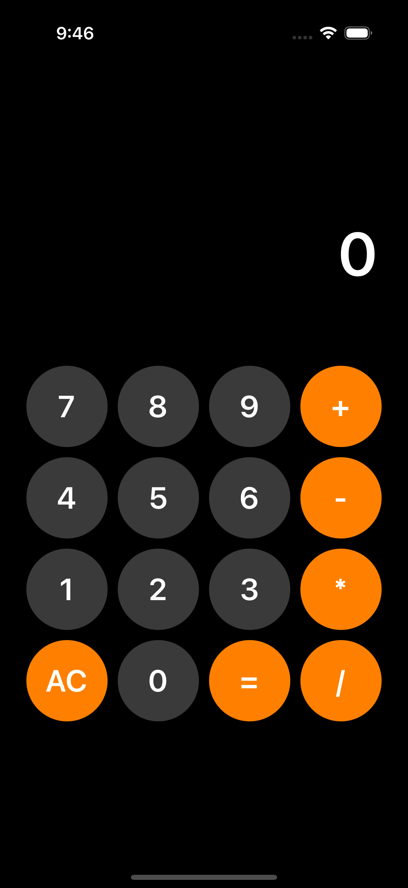

# ✖️🟰➕ 계산기 앱 만들기
Swift의 UIKit과 SnapKit을 활용하여 UI를 구성하는 간단한 정수 계산기 앱입니다.<br />

사용자의 입력을 받아 문자열로 누적하고, 등호(=)버튼이 눌렸을 때 **NSExpression**을 통해 최종 결과를 계산합니다.

<br />

## 📸 앱 화면


<br />


## 기술 스택 및 개발환경<br />
IDE: Xcode 16.4<br />
Language: Swift 6<br />
UI Framework: UIKit<br />
Layout: SnapKit (Programmatic Auto Layout)<br />

## 실행방법<br />
1. 이 저장소를 클론(Clone) 또는 다운로드합니다.
1. CalculatorApp.xcodeproj 파일을 엽니다.
1. Xcode에서 빌드 및 실행 (▶) 버튼을 누릅니다.

## 프로젝트 구조<br />
```
CalculatorApp/                  
  CalculatorApp/                # 실제 소스 코드를 포함하는 메인
    Calculator/                 
      Calculator.swift          # 계산기 UI 구성 및 핵심 로직을 담고 있는 메인 뷰 컨트롤러
    Delegate/                   
      AppDelegate.swift         # 앱 자체의 생명주기 관리 (실행, 종료 등)
      SceneDelegate.swift       # 화면(Scene)의 생명주기 관리 (연결, 해제 등)
    Utils/                      
      AddSubViewExtension.swift # 여러 개의 Subview를 한 번에 추가하는 UIView 확장(Extension)
      ButtonMakeProtocol.swift  # 계산기 버튼 한 줄을 생성하는 프로토콜
```

## 주요 기능<br />
UI 생성 도우미: ButtonMakeProtocol과 그 확장이 버튼 UI 생성을 보조합니다.<br />
계산 엔진: Foundation 프레임워크의 NSExpression이 실제 계산 로직을 담당합니다.

### 1) 프로토콜을 활용한 UI 생성 로직 분리<br />
ButtonMakeProtocol을 정의하여 Calculator 뷰 컨트롤러의 역할을 명확히 분리했습니다. 컨트롤러는 "버튼 한 줄이 필요하다"고 요청할 뿐, 버튼의 색상, 폰트, 레이아웃 등 구체적인 생성 방법에는 관여하지 않습니다.<br />

### 효과 <br />
가독성 및 유지보수성 향상: viewDidLoad가 UI 생성 코드로 복잡해지는 것을 방지합니다.<br />
재사용성 증가: 다른 곳에서도 동일한 스타일의 버튼 묶음을 쉽게 생성할 수 있습니다.<br />

### 2) 스토리보드 대신 프로그래매틱 UI + SnapKit 채택<br />
모든 UI를 코드로 작성하고 SnapKit 라이브러리를 통해 오토레이아웃을 설정했습니다.<br />
협업 효율성: 스토리보드 사용 시 발생하는 XML 파일의 충돌(Conflict) 문제를 원천적으로 방지합니다.<br />
가독성: SnapKit의 DSL(Domain-Specific Language)을 통해 오토레이아웃 코드를 직관적이고 간결하게 작성할 수 있습니다.<br />
동적 제어: 코드 기반 UI는 동적인 UI 변경 및 재사용에 더 유리합니다.<br />

### 3) 단일 액션 메서드를 통한 이벤트 처리 단순화
16개가 넘는 모든 버튼에 대해 개별 @IBAction을 만들지 않고, buttonTapped(_:)라는 단일 메서드로 모든 이벤트를 처리합니다. sender 파라미터를 통해 어떤 버튼이 눌렸는지 식별하고, 버튼의 title 값을 이용해 로직을 분기합니다.

### 효과
코드 중복 감소: 유사한 액션 메서드가 반복적으로 생성되는 것을 막습니다.
관리 용이성: 모든 버튼의 터치 이벤트 로직이 한 곳에 집중되어 있어 흐름을 파악하고 수정하기 쉽습니다.

### 4) 접근 제어(캡슐화)
UI를 구성하는 configureUI() 메서드나 계산을 수행하는 calculate(expression:) 함수 등을 private으로 선언하여 외부에서 직접 접근할 수 없도록 했습니다.
효과: Calculator 클래스의 내부 구현을 숨기고, 외부에서는 오직 공개된 API(사용자 터치 등)를 통해서만 상호작용하도록 강제하여 안정성을 높입니다.

### ⚙️ 주요 컴포넌트 요약<br />

#### Calculator.swift<br />
앱의 핵심. UI 요소(UILabel, UIButton)의 생명주기를 관리합니다.
SnapKit을 사용하여 모든 UI 요소의 레이아웃을 설정합니다.
buttonTapped(_:)를 통해 사용자 입력을 받아 resultText의 상태를 갱신합니다.
NSExpression을 호출하여 최종 계산을 수행합니다.

#### ButtonMakeProtocol<br />
makeButtonLine이라는 메서드를 통해 버튼 한 줄(배열)을 생성하는 역할을 정의합니다.
실제 구현은 extension에 포함되어, 숫자 버튼과 연산자 버튼의 스타일을 구분하여 생성합니다.

#### NSExpression<br />
"10+5*2"와 같은 문자열 형태의 수식을 직접 해석하고 계산하는 강력한 클래스입니다. 덕분에 복잡한 후위 표기식 변환이나 연산자 우선순위 처리 로직을 직접 구현할 필요가 없었습니다.

## 💻 IDEs/Editors<br />
<br />
## 📋 Languages<br />
<br />
## 🕓 Version Control<br />
<br />
## 🎛️ Operating System<br />
<br />
